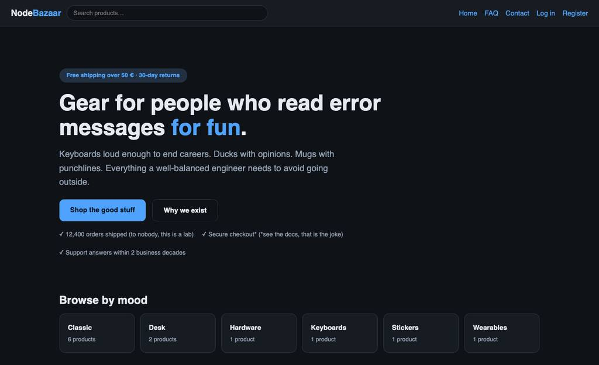
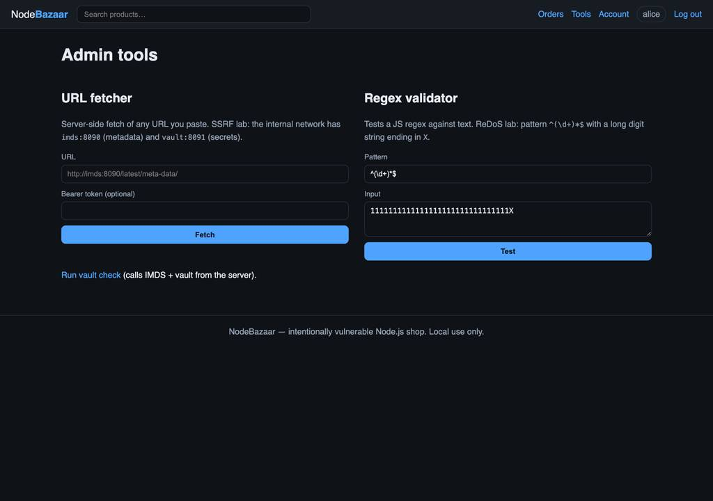

# NodeBazaar (vulnerable-node)

<p align="center">
  <strong>A real Node.js shop that is intentionally full of security bugs.</strong><br/>
  Express · Postgres · Mongo · Docker Compose · OWASP Top 10:2025
</p>

<p align="center">
  Inspired by <a href="https://github.com/digininja/DVWA">DVWA</a>
  · Author <a href="https://github.com/cr0hn">Daniel García (cr0hn)</a>
  · <a href="LICENSE">BSD</a>
</p>



**This is not a toy mock.** NodeBazaar is a working storefront: catalog, product pages, reviews, checkout with a Stripe-style test card, orders, account, admin tools, and a small JSON API. The bugs are real code paths against real Postgres and Mongo. When you inject SQL, you hit PostgreSQL. When you SSRF, the app reaches services on the Docker network. Nothing is faked with a hardcoded "hack succeeded" string.

> **Local use only.** Never expose this stack to the internet.

## Screenshots

| Product | Cart/Checkout | Orders | Tools |
|:---:|:---:|:---:|:---:|
|  |  |  |  |

## Why it exists

The original *vulnerable-node* (2016) had one goal: real vulnerable Node.js code — not simulated — to measure the quality of security analyzers and train pentesters. This rewrite keeps that mission and adds what the original never had: a complete application to protect, exploit guides, and fixes.

Every risky spot is marked in the source:

- `VULN:` what is wrong and why it matters
- `SAFE:` what to do instead

You can learn from the UI, from [`docs/labs/`](docs/labs/), or by reading the code next to the bug.

## Quick start

```bash
docker compose up --build
```

Open **http://localhost:8888**

Default host port is `8888` so it does not fight proxies on `8080` (Caido and friends). Override with `APP_PORT=9999` if needed.

You only need Docker. No host Node.js, Postgres, or Mongo.

**The catalog is public** — like a real shop. Login is only required to post reviews or see order history; checkout works as guest too (and the guest flow is where CSRF and price tampering get interesting).

Optional: import [`postman/NodeBazaar.postman_collection.json`](postman/NodeBazaar.postman_collection.json) (`baseUrl` = `http://localhost:8888`).

### Lab accounts

| Username | Password  | Role     |
|----------|-----------|----------|
| alice    | alice123  | customer |
| bob      | bob123    | customer |
| admin    | admin123  | admin    |

Test card: `4242 4242 4242 4242`

## Vulnerability map

| # | Vulnerability | OWASP Top 10:2025 | Where | Lab |
|---|---------------|-------------------|-------|-----|
| 01 | BOLA / IDOR on orders | [A01 Broken Access Control](https://owasp.org/Top10/2025/) | `routes/orders.js`, `routes/api/v1.js` | [docs](docs/labs/01-bola-idor.md) |
| 02 | SSRF → IMDS → vault | A01 (SSRF) | `routes/tools.js`, `mocks/` | [docs](docs/labs/02-ssrf-imds.md) |
| 03 | SQL injection: login, search, sort | [A05 Injection](https://owasp.org/Top10/2025/) | `model/db.js` | [docs](docs/labs/03-sqli.md) |
| 03b | NoSQL injection on Mongo filters | A05 Injection | `routes/shop.js` + Mongo | [docs](docs/labs/03b-nosql.md) |
| 04 | Mass assignment → admin | [A06 Insecure Design](https://owasp.org/Top10/2025/) | `routes/auth.js`, `routes/account.js` | [docs](docs/labs/04-mass-assignment.md) |
| 05 | Stored XSS + token theft | A05 Injection | reviews + `localStorage` | [docs](docs/labs/05-xss-token-theft.md) |
| 06 | Checkout price tampering | A06 Insecure Design | checkout `amount_cents` | [docs](docs/labs/06-price-tamper-checkout.md) |
| 06b | CSRF (no tokens anywhere) | A01 | every `POST` route | [docs](docs/labs/06b-csrf.md) |
| 07 | Forgeable JWTs (`/api/v1/*`) | [A07 Authentication Failures](https://owasp.org/Top10/2025/) | `config.js`, `middleware/auth.js` | [docs](docs/labs/07-jwt-weak-secret.md) |
| 08 | PAN / CVV stored in clear | [A04 Cryptographic Failures](https://owasp.org/Top10/2025/) | orders / `payment_attempts` | [docs](docs/labs/08-crypto-pan-storage.md) |
| 09 | Debug + verbose errors | [A02 Security Misconfiguration](https://owasp.org/Top10/2025/) / A10 | `DEBUG_ERRORS`, search | [docs](docs/labs/09-misconfig-debug.md) |
| 10 | Secrets in logs + log injection | [A09 Logging & Alerting Failures](https://owasp.org/Top10/2025/) | login prints | [docs](docs/labs/10-logging-failures.md) |
| 11 | Poisoned CI pipelines | [A03](https://owasp.org/Top10/2025/) / [A08](https://owasp.org/Top10/2025/) | `.github/workflows/`, `azure-pipelines.yml` | [docs](docs/labs/11-poisoned-pipelines.md) |
| 12 | Secret still in git history | A02 / A04 | early `.env` commit | [docs](docs/labs/12-secrets-in-git.md) |
| 13 | Prototype pollution via merge | [A08 Software/Data Integrity Failures](https://owasp.org/Top10/2025/) | `model/merge.js`, `/preferences` | [docs](docs/labs/13-prototype-pollution.md) |
| 14 | ReDoS: event loop outage | A05 / availability | `routes/tools.js` regex tester | [docs](docs/labs/14-redos.md) |

Cookie session drives the HTML shop. Broken JWTs are only used under `/api/v1/*`.

Full walkthroughs with short fixes: **[docs/labs/](docs/labs/)**.

## Self-commented code

Open any route under `routes/` and search for `VULN:` / `SAFE:`. The teaching note sits next to the line that fails review in real PRs. Example idea:

```js
// VULN (A01 BOLA): login checked, ownership not.
// SAFE: add "AND user_id = $2" with the session user id.
const { rows } = await db.orderById(req.params.id);
```

## Stack

- Node.js 22 + Express 4 (server-rendered EJS UI + small JSON API)
- PostgreSQL via `pg`
- MongoDB (tag filter / NoSQL lab)
- Plain CSS, no build step
- Docker Compose
- Local IMDS + vault mocks for SSRF

## CI pipelines

[`.github/workflows/ci.yml`](.github/workflows/ci.yml) and [`azure-pipelines.yml`](azure-pipelines.yml) are the files GitHub/Azure DevOps would pick up. They are **unsafe on purpose** (PR builds reach secrets, untrusted values land in shell). Compare with [`ci-hardened.yml`](.github/workflows/ci-hardened.yml) and [`pipelines/azure-pipelines.hardened.yml`](pipelines/azure-pipelines.hardened.yml). Do not point either at real credentials.

## Secrets in git

An early commit added a fake `.env` with `PIPELINE_TOKEN`. A later commit removed it from `HEAD`. The value remains in history:

```bash
git log -p --all -S 'VN-FAKE' -- .env
```

## SAST benchmark mission

The original reason this repo exists: measuring how well source code analyzers (SAST) do against real Node.js code. [`sast/`](sast/) keeps that mission: self-contained vulnerable seed files with a ground-truth manifest, so you can run any analyzer and score true/false positives.

See [`sast/README.md`](sast/README.md).

## Layout

```
server.js            Express app (VULN / SAFE commented)
routes/              Shop, auth, orders, account, tools, /api/v1
model/               Data access (vulnerable queries) + merge gadget
middleware/          Session + JWT guards
views/, public/      EJS templates and assets
mocks/               Fake IMDS + vault for the SSRF lab
db/                  Schema + seed
docs/labs/           Exploit guides + fixes
docs/screenshots/    UI captures for this README
postman/             Postman collection
sast/                Analyzer benchmark seeds + ground truth
.github/workflows/   GitHub Actions (unsafe + hardened)
azure-pipelines.yml, pipelines/   Azure DevOps (unsafe + hardened)
```

## Author

Main author: [Daniel García (cr0hn)](https://github.com/cr0hn). More at [cr0hn.com](https://cr0hn.com).

## License

BSD ([LICENSE](LICENSE)). For learning and local research. Not a real store, even when it looks like one.